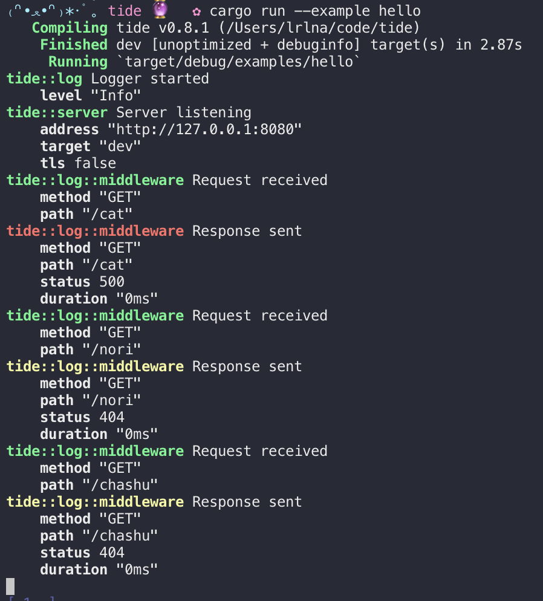
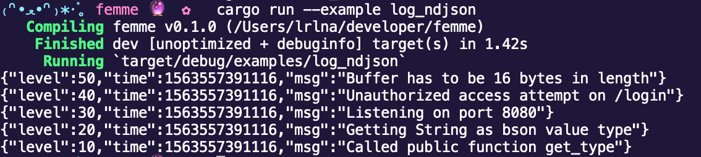

# femme
[![crates.io version][1]][2] [![build status][3]][4]
[![downloads][5]][6] [![docs.rs docs][7]][8]

Not just a pretty (inter)face.

A pretty-printer and [ndjson](http://ndjson.org/) logger for the [log](https://docs.rs/log) crate.

- [Documentation][8]
- [Crates.io][2]
- [Releases][releases]

## Examples
```rust
use kv_log_macro as log;

femme::with_level(femme::LevelFilter::Trace);
log::warn!("Unauthorized access attempt on /login");
log::info!("Listening on port 8080");
```

Prettified output will be displayed when debugging. In release mode, this logger
will output to ndjson.

When using Wasm with `#[cfg(target_arch = "wasm32")]`, Wasm logger will be used.
Wasm logger uses `web_sys` crate to send `console.log()` to JavaScript.

## Screenshots
### Pretty Output


### Newline Delimited JSON



## Installation
```sh
$ cargo add femme
```

## License
[MIT](./LICENSE-MIT) OR [Apache-2.0](./LICENSE-APACHE)

[1]: https://img.shields.io/crates/v/femme.svg?style=flat-square
[2]: https://crates.io/crates/femme
[3]: https://img.shields.io/travis/lrlna/femme/master.svg?style=flat-square
[4]: https://travis-ci.org/lrlna/femme
[5]: https://img.shields.io/crates/d/femme.svg?style=flat-square
[6]: https://crates.io/crates/femme
[7]: https://img.shields.io/badge/docs-latest-blue.svg?style=flat-square
[8]: https://docs.rs/femme

[releases]: https://github.com/lrlna/femme/releases
