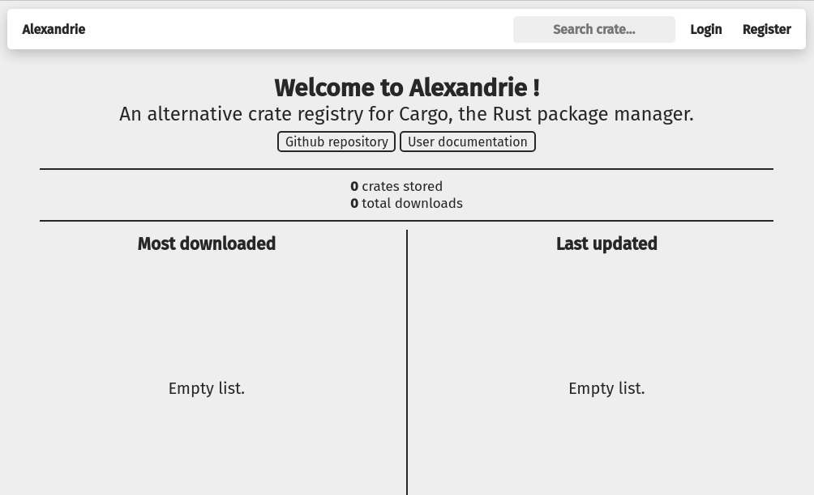

# Running Alexandrie via Docker

## Introduction

[crates.io](https://crates.io/) is the Rust community's public package registry. Rust libraries (crates) are often published and shared via crates.io. 

Often, teams and people may want to publish packages to internal, non-public-facing registries.

Alexandrie is an open source implementation of the Crates Registry API.

This tutorial walks through setting up a local instance of Alexandrie so you can test publishing a crate to an [alternate registry](https://doc.rust-lang.org/cargo/reference/registries.html#using-an-alternate-registry)

## Dependencies
- [Docker](https://docs.docker.com/get-docker/)

## Steps

### Pull Image
We provided a docker image you can use to run a local instance of Alexandrie. Pull it with the command: 
> docker pull rtohaan/alexandrie:latest

This image uses the default Alexandrie configuration that comes with a pre-installed SQLite3 for data storage.

Alternatively, you can build it yourself from the root of this repo with the command:
> docker build -t alexandrie -f Dockerfile .

The remaining steps assume you have pulled `rtohaan/alexandrie:latest`.

### Setting up directories for application data
Alexandrie requires 3 locations to store data. 
- `./crate-storage` - stores the crate's binaries
- `./data` - will contain the SQLite database that Alexandrie needs to keep track of accounts, tokens, etc.
- `./crate-index` - is a git repo that stores meta-data for each version of the crate. [See the alternate-registry spec here](https://github.com/rust-lang/rfcs/blob/master/text/2141-alternative-registries.md#registry-index-format-specification). The crate index is additionally what consumers would use to reference available crates and versions in a given registry.

We will create these directories and mount them into our running container so we can persist relevant application data between restarts.

Create a new empty working directory
```bash
mkdir scratch
cd scratch
```

Create the storage and data directories.
```
mkdir crate-storage
mkdir data
```

To create `./crate-index`, we've provided a template repo you can use to initialize your local crates index repo.

```bash
git clone https://github.com/RangerStation/rangerstation-alexandrie-index.git ./crate-index

cd crate-index
```

For running a local instance only, we'll set the git remote of the index repo to be the path where it will be mounted into Alexandrie, so our local Alexandrie instance can easily `git push` when making updates for new crates.

```
git remote set-url origin file://localhost/alexandrie/crate-index
```

Save the absolute path to this crates index repo on your *host machine* for use later in configuring `cargo`.

```
export CRATES_INDEX_HOST_PATH=$(pwd)
```

> This is for develoment purposes. In a more production use case, you want to configure a remote repo and give the Alexandrie application access to write to it, and configure `cargo` to use the hosted repo. 

Go back into the root of your working directory.

```
cd ..
```

Your local directory structure should look like 
```
scratch
├── crate-index
│   ├── config.json
│   ├── crate-index
│   ├── crate-storage
│   ├── data
│   │   └── alexandrie.db
│   └── README.md
├── crate-storage
└── data
```

### Starting the container

Ensure you are in the root of your working directory.

Common flags used with `docker run` are
- `-p` Binds the port being used in the docker container to a port on your local machine
- `-d` Runs the docker container in the background
- `-v` Mounts the docker container to your local filesystem
- `-it` Makes the docker container interactable through your terminal emulator

Start your local instance of Alexandrie, mounting to your local directories with:
```
docker run \
    -it \
    -p 3000:3000 \
    -v $(pwd)/crate-index:/alexandrie/crate-index \
    -v $(pwd)/crate-storage:/alexandrie/crate-storage \
    -v $(pwd)/data:/alexandrie/data \
    rtohaan/alexandrie:latest
```

Congrats! Your Alexandrie instance is running and available at `localhost:3000`. Visit `localhost:3000` in your browser to see the Alexandrie home page.


### Create a new user and token
Visit `http://localhost:3000/`, and on the top right, register a new user.

Visit `http://localhost:3000/account/manage` to create a token for your user.

Copy your token and keep it handy. We'll need this to login through `cargo`.


### Configuring an Alternate Registry

We'll configure your local `cargo` with an [alternative crates registry](https://doc.rust-lang.org/cargo/reference/registries.html#using-an-alternate-registry), pointing to your locally configured Alexandrie application.

Create a `~/.cargo/config` file if it does not already exists.

Append this block in `~/.cargo/config` to add a new registry, naming it `local`. 

Use the path we saved into the `CRATES_INDEX_HOST_PATH` variable earlier. For example, if your `CRATES_INDEX_HOST_PATH` is `/home/ranger/scratch/crate-index`, your entry will be

```toml
[registries.local]
index = "file://localhost/home/ranger/scratch/crate-index"
```

Next, we need to login to your local registry with
```bash
cargo login --registry local <token>
```

### Publishing a crate
In a new terminal, create a dummy crate to publish to our registry
```
cargo new testpackage
cd testpackage
```

Commit the new crate.
```
git add . 
git commit -m "new crate"
```

Publish
```bash
cargo publish --registry local
```

## Conclusion
With this tutorial we have covered pulling the docker image from Docker Hub, running a local instance of a crates registry, configured our local `cargo` to reference the local crates registry, and published a crate to it!