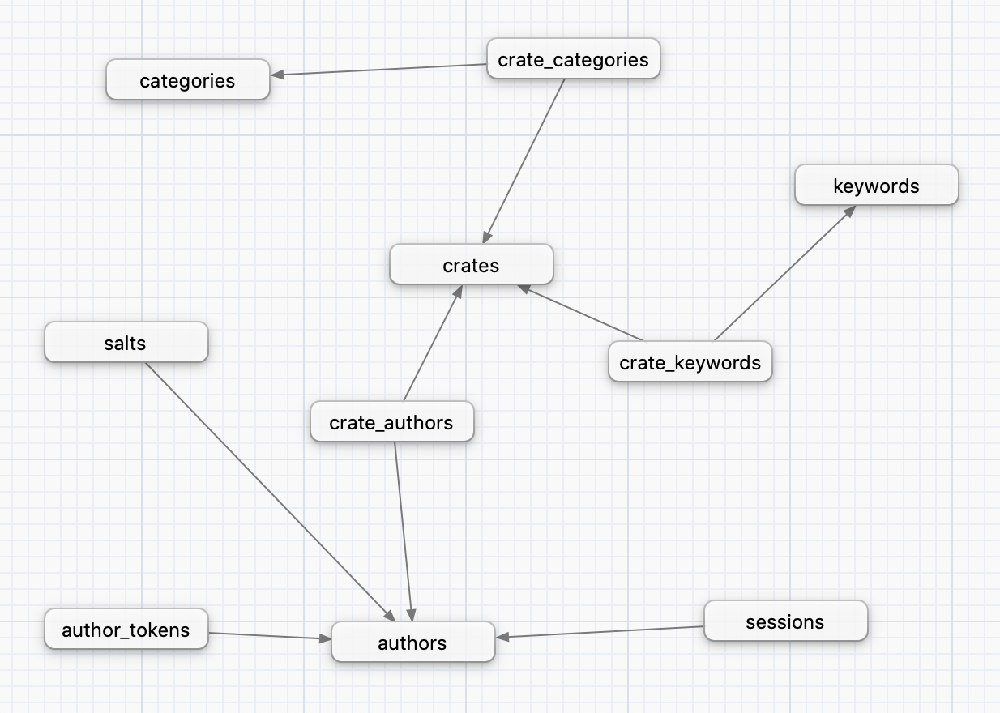

Database layout
===============

This page describes the database tables that Alexandrie uses.

The types of the tables' fields are chosen to be compatible with all the database vendors supported by Alexandrie.  

Here is a high-level picture of the different tables and their relationships:

The **`crates`** table stores metadata about the latest version of each stored crate.  
It is meant to store the most useful metadata for fast access.  
If more complete metadata is required or metadata about an older version is needed, the crate-index can be queried for this.  

The **`authors`** table stores the list of every registered crate authors of the registry.  
It stores details like emails, fullnames and a signature of the author's password.  
Details about what this signature really is, and how to compute it from the users' password is available at:  
[**https://polomack.eu/alexandrie-security**](https://polomack.eu/alexandrie-security)

The **`keywords`** and **`categories`** tables store the keywords and categories used by the registry's crates.  
The **`keywords`** table can gain new entries as crates makes use of new distinct keywords.  
The **`categories`** table, on the other hand, is fixed and not expandable by crates.  

The **`salts`** table stores the salts generated for each registered author and used to compute their passwords' signatures.  
The **`sessions`** table stores details about the frontend sessions for registered authors.  
Sessions are not automatically deleted when expired, so a cleanup periodic clean may be required to prune expired sessions.  
The **`author_tokens`** tables stores the generated Cargo authentication tokens for registered users (used for `cargo login`).  

The **`crate_categories`**, **`crate_keywords`** and **`crate_authors`** are all one-to-many relationship tables.  
