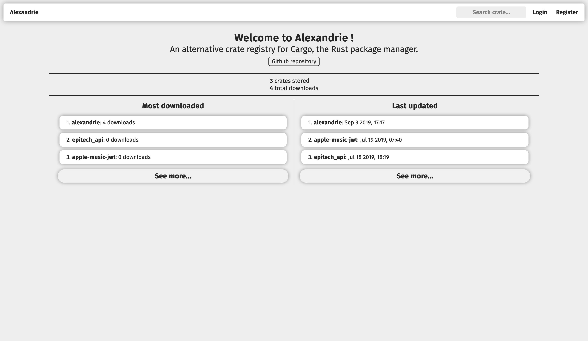

Welcome to Alexandrie
=====================

**Alexandrie** is a modular alternative crate registry for Rust crates.  

It implements the Rust's [**Alternative Crate Registries RFC**][Alternative Crate Registries RFC] in order to be usable with [**Cargo**][Cargo].  
It seeks to be **modular**, **extensible** and **configurable** to be usable in many different environments, from a openly-accessible crate store to a private registry in a company's toolchain.  

It includes both a **programmatic API** and an optional **server-rendered frontend**.  

[Alternative Crate Registries RFC]: https://github.com/rust-lang/rfcs/blob/master/text/2141-alternative-registries.md
[Cargo]: https://doc.rust-lang.org/cargo
